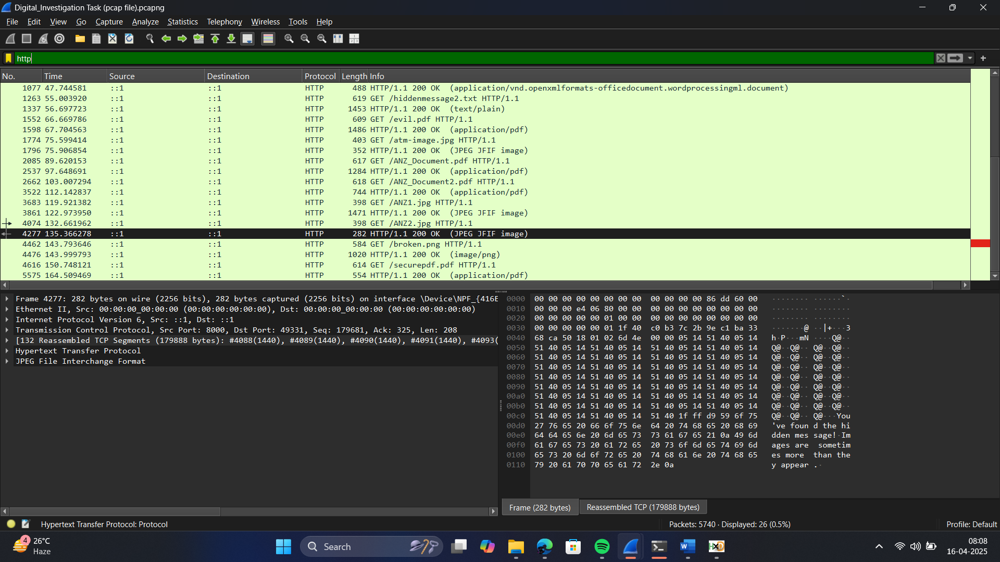

# Digital-Investigation
ANZ Australia Cyber Security Management Job Simulation on Forage - April 2025
 * Completed a simulation focussed on identifying cybersecurity threats at ANZ
 * Investigated e-mails to report suspicious items
 * Analysed a Packet Capture file using an open source tool to identify and
   investigate any potential threats

 
